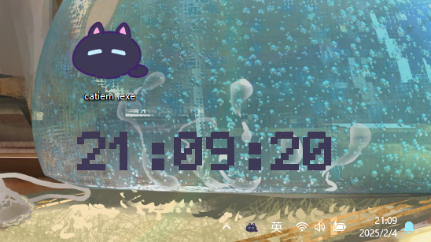
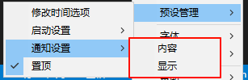
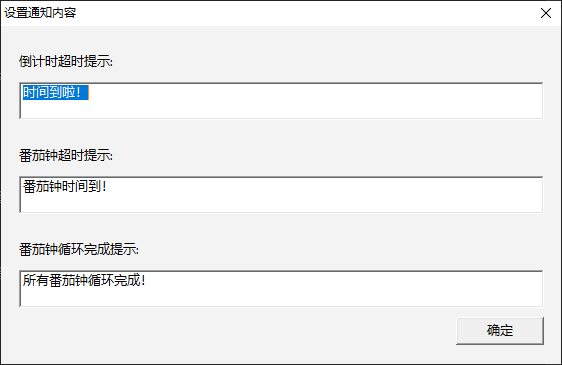
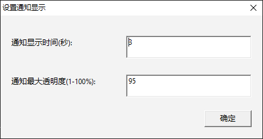
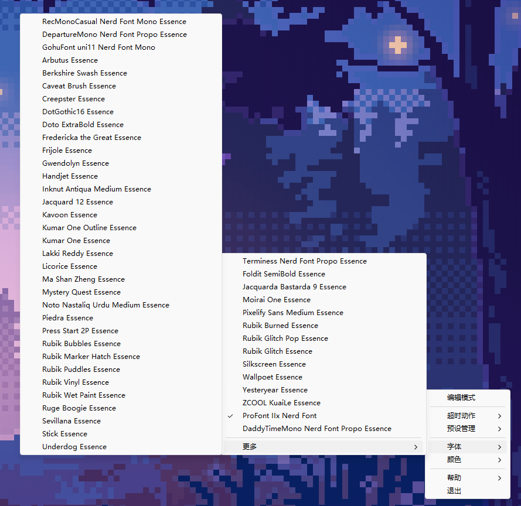
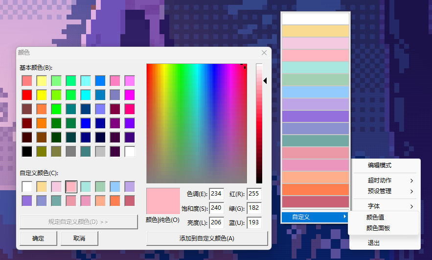
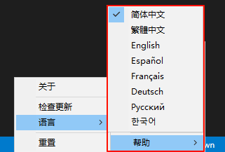

# 右键点击设置选项

## 编辑模式

- 交互方式：鼠标悬停在时间区域时，按住左键可自由拖动调整位置（参考示例图）。
- 退出方式：右键点击时间区域，退出编辑模式并保存当前位置。

## 超时动作

倒计时结束触发，用户可自定义以下动作：

### 显示消息

屏幕右下角弹出非打扰式通知（如示例图，含简洁文案与图标）。

### 显示当前时间

时间区域自动切换为实时时钟模式，显示当前系统时间

### 正计时

倒计时结束后自动切换为正计时模式，实时显示累计时长

### 锁定屏幕

倒计时结束时自动锁定电脑屏幕（模拟 Win + L 快捷键操作）。

### 打开文件/软件

支持选择本地应用（如启动 Photoshop.exe）或文件（如打开 C:\Notes.txt）。

### 打开网站

输入URL（如 `https://example.com`），倒计时结束后自动在默认浏览器中打开。

### 关机

立即执行系统关机命令。

### 重启

立即执行系统重启命令。

## 预设管理

### 修改时间选项

### 启动设置

- 倒计时：启动后直接进入预设倒计时（需关联预设时长）
- 正计时：启动后自动开始正向计时（记录任务耗时）
- 显示当前时间：时间区域实时同步系统时钟（动态更新）
- 不显示：隐藏时间区域，仅保留任务栏图标（需右键图标恢复）
- 开机自启动：将软件加入系统启动项

### 通知设置

超时动作选择【显示消息】时，自定义通知内容与样式。

- 内容定制：
    - 倒计时结束提示：如“专注时间结束，休息一下吧！”
    - 番茄钟超时提示：如“本次番茄钟已完成，剩余循环：3/5”
    - 番茄钟循环完成提示：如“所有番茄钟循环已完成！”

  

- 显示属性：
    - 显示时长：设置通知提示框的停留时间
    - 透明度：调节提示框的透明度（0%~100%）

  

### 置顶

启用后：时间区域始终悬浮在其他应用上方（适合全屏场景）

## 字体

自定义时间区域的字体样式。

## 颜色

自定义时间区域的字体颜色显示，提供默认颜色以及自定义颜色入口，自定义颜色支持`颜色值`和`颜色面板`两种方式

## 帮助

- 关于：显示软件基本信息，包括版本号、开发者信息、版权声明等。
- 检查更新：手动检测并下载最新版本
- 语言：切换软件界面语言，适配多语言用户群体
- 重置（道法自然）：一键恢复所有设置为出厂默认状态，解决配置异常问题

  